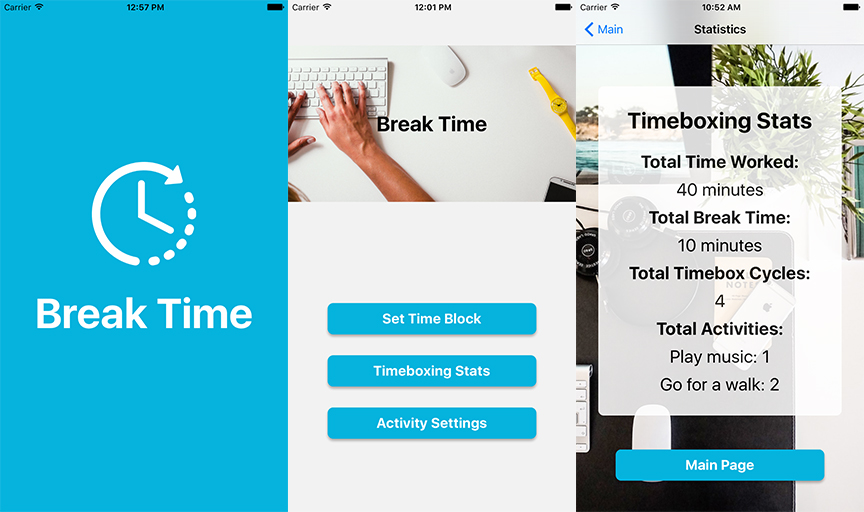
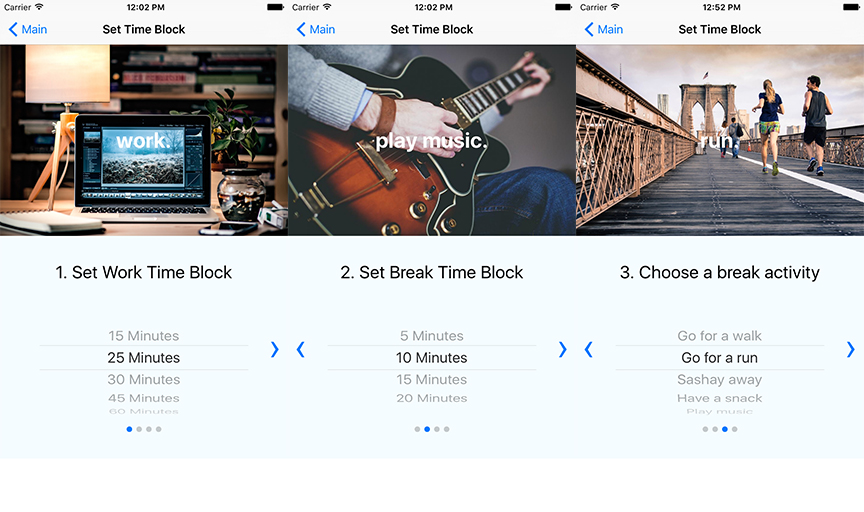
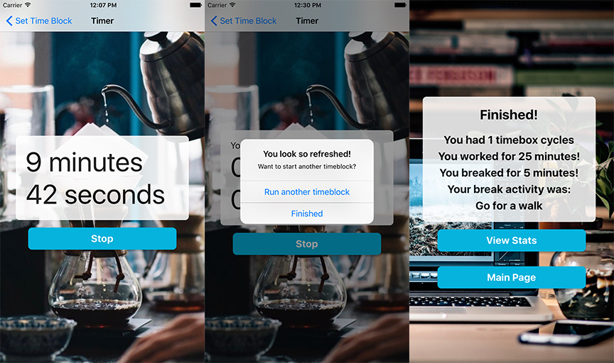

Breaktime is a timeboxing mobile app focusing on taking meaningful breaks between work periods and keeping you active.  Timeboxing is a concept based off the Pomorodo technique. 

Breaktime was created as a final project at Dev Bootcamp with React Native for iOS.   

Breaktime was created by [LeeAnne Hawley](https://github.com/LHAWLEY), [Aaron Opsahl](https://github.com/Rinthm), [Kathryn Garbacz](https://github.com/Katushe), [Linda Ho](https://github.com/oanhcodes), [Tim Kelly](https://github.com/timlkelly).

